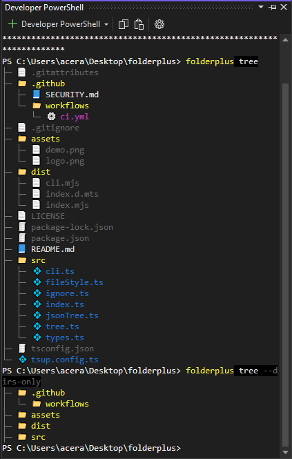

# FolderPlus

Modern developer-friendly CLI tool to visualize project structures with icons, filtering, sorting, JSON output, and `.gitignore` support.


# Cross-platform support:

  * Windows
  * Linux
  * macOS

# Preview



# Installation

### npm

```bash
npm install -g folderplus@latest
```

### pnpm

```bash
pnpm add -g folderplus
```

### Yarn

```bash
yarn global add folderplus
```

### Bun

```bash
bun add -g folderplus
```

### Local Installation

```bash
npm install folderplus
```

# Verify Installation

```bash
folderplus version
```
```bash
or
```

```bash
folderplus --version
```

# Usage

### Basic tree

```bash
folderplus tree
```

### Files only

```bash
folderplus tree --files-only
```

### Directories only

```bash
folderplus tree --dirs-only
```

### Limit depth

```bash
folderplus tree --depth 2
```

### Filter extensions

```bash
folderplus tree --only js,ts
```

### Ignore directories

```bash
folderplus tree --ignore dist,build,temp
```

### JSON output

```bash
folderplus tree --json
```

# Options

| Flag              | Description                            |
| ----------------- | -------------------------------------- |
| `--all`           | Show hidden files and folders          |
| `--no-icons`      | Disable icons                          |
| `--files-only`    | Show only files                        |
| `--dirs-only`     | Show only directories                  |
| `--depth <n>`     | Limit tree depth                       |
| `--only <ext>`    | Filter by extensions, e.g. `js,ts`     |
| `--ignore <dirs>` | Exclude directories, e.g. `dist,build` |
| `--json`          | Output tree as JSON                    |

---

# JSON Output Example

```bash
folderplus tree --json
```

```json
{
  "name": "project",
  "type": "directory",
  "children": [
    {
      "name": "src",
      "type": "directory"
    },
    {
      "name": "index.js",
      "type": "file"
    }
  ]
}
```

---

# Ignore Behavior

By default, FolderPlus ignores:

* `node_modules`
* `.git`
* Entries listed inside `.gitignore`

Custom ignores:

```bash
folderplus tree --ignore dist,build,temp
```

# Use Cases

- Visualize large codebases.
- Generate project structure for documentation.
- Export project trees as JSON.
- Quickly inspect repositories.
- Improve developer workflow and debugging.

# Features

- Beautiful project tree with icons.
- Filter files or directories only.
- Automatic `.gitignore` support.
- Filter by file extensions.
- Exclude unwanted directories and files.
- Sorting by name or type.
- JSON output for tooling and automation.
- Fast and lightweight.


# Help

```bash
folderplus --help
```

# License


# Author

Maintained by [__SMORIGINALS__](https://github.com/smoriginals)
